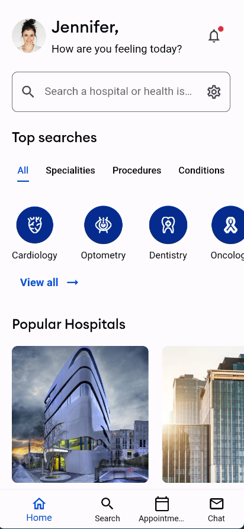
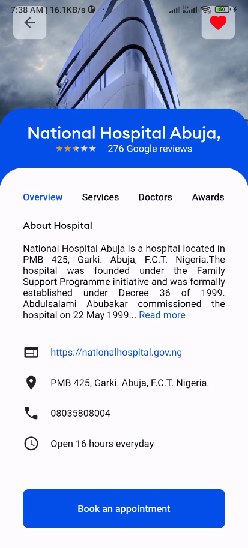
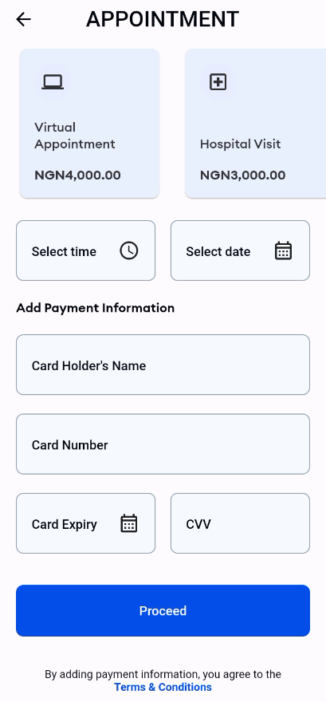
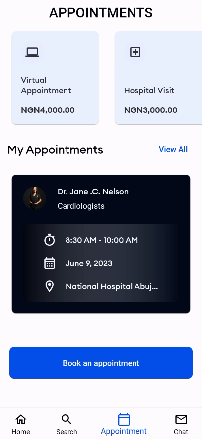
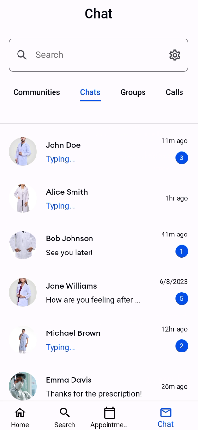

# Hospital Link Up UI

A flutter project that depicts a simple app to link up hospitals

## Description

This project aims to develop a simple mobile application ui that serves as a platform to connect and
link up hospitals.
This app facilitates seamless communication and collaboration between hospitals, enabling them to
share resources,
exchange medical information, and coordinate patient transfers more efficiently.
The UI (User Interface) aspect of the app focuses on creating an intuitive and user-friendly design
that enhances the user experience and promotes effective interaction between hospitals.

## Features

- User-friendly home, search, appointment and search screens.
- Well-structured codebase that is easy to understand and maintain.

## Screenshots

<table>
<tr>
<td valign="top" width="50%">

</td>
<td valign="top" width="50%">

</td>
</tr>
<tr>
<td valign="top" width="50%">

</td>
<td valign="top" width="50%">

</td>
</tr>
<tr>
<td valign="top" width="50%">

</td>
<td valign="top" width="50%">

</td>
</tr>
<tr>
<td valign="top" width="50%">

</td>
<td valign="top" width="50%">
</tr>
</table>

## App Demo

The apk to the app can be found in the actions tab

## Installation

Clone the repository from Github:

``` bash
git clone https://github.com/logickoder/hospital-link-up-ui.git
```

Navigate to the project directory:

``` bash
cd hospital-link-up-ui
```

Run the app on your emulator or physical device:

```arduino
flutter run
```

## Requirements

Flutter installed on your system
Emulator or physical device for testing

## Contributing

Contributions are welcome! Please feel free to fork the repository and submit pull requests. Make
sure to follow the existing code conventions and try to include tests with your changes.

## License

This project is licensed under the MIT License - see the LICENSE.md file for details.